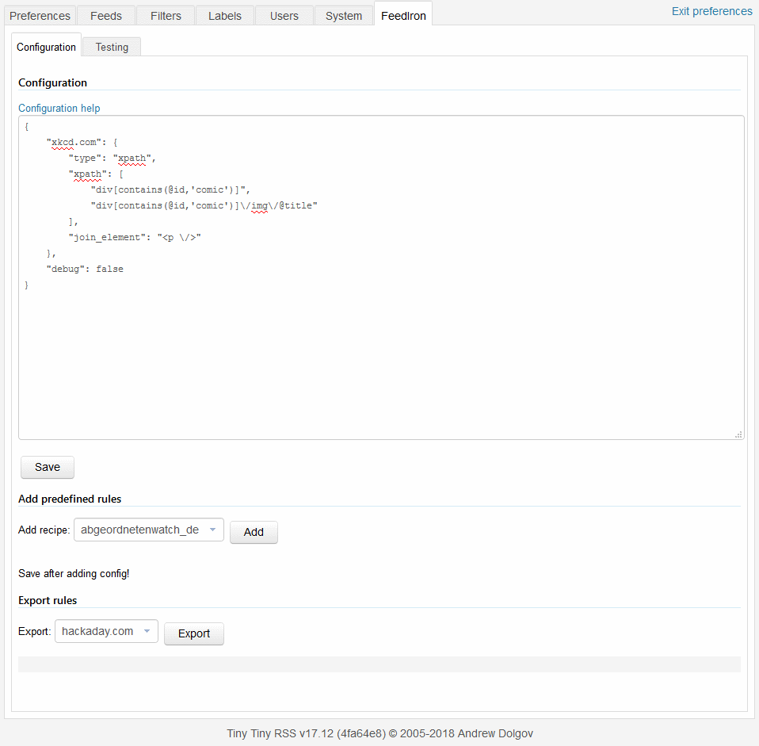
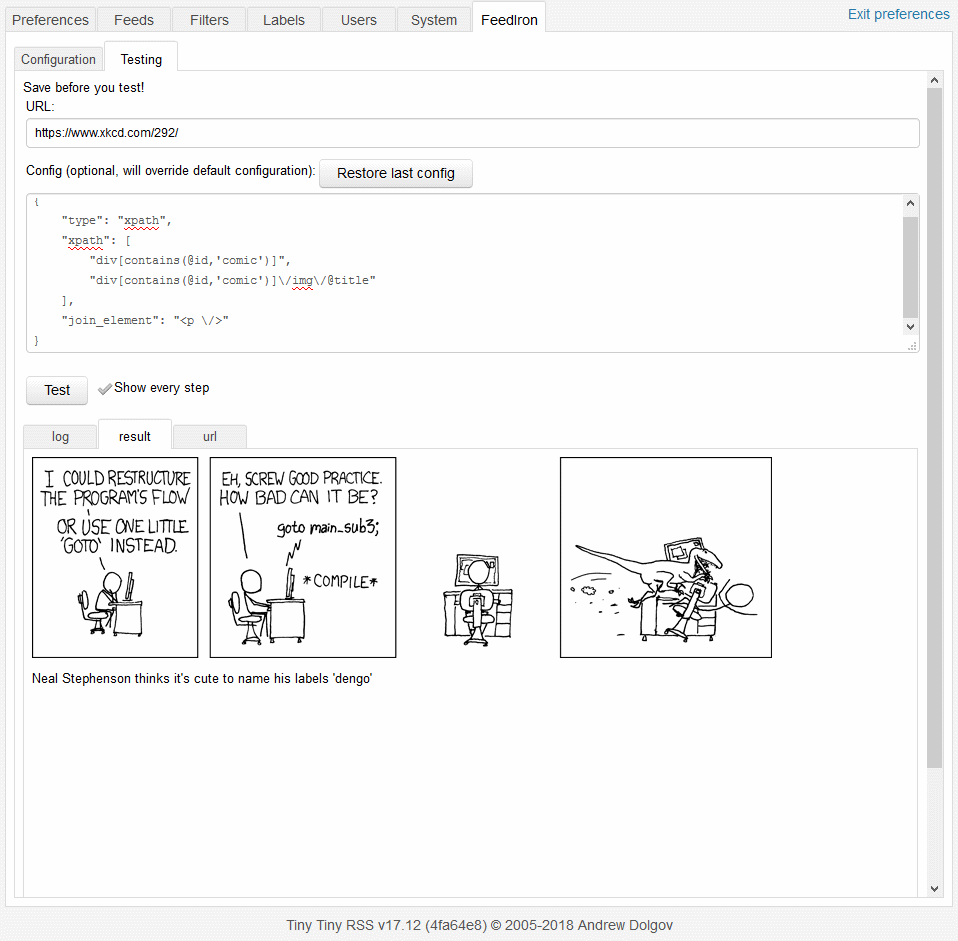

# Feediron TT-RSS Plugin 
Reforge your feeds

About |Table Of Contents
 :---- | --------
This is a plugin for [Tiny Tiny RSS (tt-rss)](https://tt-rss.org/).<br>It allows you to replace an article's contents by the contents of an element on the linked URL's page<br><br>i.e. create a "full feed".<br><br>Keep up to date by subscribing to the [Release Feed](https://github.com/feediron/ttrss_plugin-feediron/releases.atom)|<ul><li>[Installation](#installation)</li><li>[Configuration tab](#configuration-tab)</li><ul><li>[Usage](#usage)</li><li>[Filters](#filters)</li><li>[General Options](#general-options)</li><li>[Global Options](#global-options)</li></ul><li>[Testing Tab](#testing-tab)</li><li>[Full configuration example](#full-configuration-example)</li><li>[Xpath General Information](#xpath-general-information)</li></ul>

## Installation

Checkout the directory into your plugins folder like this (from tt-RSS root directory):

```sh
$ cd /var/www/ttrss
$ git clone git://github.com/m42e/ttrss_plugin-feediron.git plugins.local/feediron
```

Then enable the plugin in TT-RSS preferences.

### Optional

Install [Readability.php](https://github.com/andreskrey/readability.php) using [composer](https://getcomposer.org/). Assuming composer is installed, navigate to the feeiron plugin folder with `composer.json` present and run:

```
$ composer install
```
___

# Layout

After install in the TinyTinyRSS preferences menu  you will find new tab called FeedIron. Under this tab you will have access to the FeedIron Configuration tab and the FeedIron Testing tab.

# Configuration tab
The configuration for FeedIron is done in [JSON format](https://json.org/) and will be displayed in the large configuration text field. Use the large field to enter/modify the configuration data and click the Save button to store it.

Additionally you can load predefined rules submitted by the community or export your own rules. To submit your own rules you can submit a pull request through Github.



## Usage

There are three (3) types of [Filters](#filters), five (5) [general options](#general-options) and one (1) [global option](#global-options). Note: The rule `type` Must be defined and has to be one of the following: `xpath`, `split` or `readability`.

The best way to understand Feediron is to read the [Full configuration example](#full-configuration-example)

### Basic Configuration:

A Basic Configuration must define:

1. The site string. e.g. `example.com`
	* Use the same configuration for multiple URL's by seperating them with the `|` Delimiter. e.g. `"example.com|example.net"`
	* The configuration will be applied when the site string matches the `<link>` or `<author>` tag of the RSS feed item.
		* The `<link>` takes precedence over the `<author>`
		* `<author>` based configurations will **NOT** automatically show in the Testing Tab
2. The Filter type. e.g. `"type":"xpath"`
3. The Filter config. e.g. `"xpath":"div[@id='content']"` or the array `"xpath": [ "div[@id='article']", "div[@id='footer']"]`


Example:
```json
{
  "example.com":{
    "type":"xpath",
    "xpath":"div[@id='content']"
  },
  "secondexample.com":{
    "type":"xpath",
    "xpath": [
      "div[@id='article']",
      "div[@id='footer']"
    ]
  }
}
```
<sub>Note: Take care while values are separated by a `,` (comma) using a trailing `,` (comma) is not valid.</sub>

---

# Filters:

* [xpath](#xpath-filter) - `"type":"xpath"`
	* [xpath](#xpath---xpathxpath-str---array-of-xpath-str-)  - `"xpath":"xpath str" / [ "array of xpath str" ]`
	* [index](#index---index-int) - `"index":int`
	* [multipage](#multipage---multipageoptions) - `"multipage":{options}`
		* xpath - `"xpath":"xpath str"`
		* [append](#append---appendbool) - `"append":bool`
		* [recursive](#recursive---recursivebool) - `"recursive":bool`
	* [start_element](#start_element---start_elementstr) - `"start_element":"str"`
	* [join_element](#join_element---join_elementstr) - `"join_element":"str"`
	* [end_element](#end_element----end_elementstr) - `"end_element":"str"`
	* [cleanup](#cleanup---cleanupxpath-str---array-of-xpath-str-) - `"cleanup":"xpath str" / [ "array of xpath str" ]`
* [split](#split---typesplit) - `"type":"split"`
	* [steps](#steps---steps-array-of-steps-) - `"steps":[ array of steps ]`
      * after - `"after":"str"`
      * before - `"before":"str"`
	* [cleanup](#cleanup-cleanup-array-of-regex-) - `"cleanup":"/regex str/" / [ "/array of regex str/" ]`
* [readability](#readability) - Note: Also accepts all [Xpath type](#xpath-filter) options
	1. [PHP-Readability](#php-readability)
	2. [Readability.php](#readabilityphp) (Optionally installed)
		* [relativeurl](#relativeurl---relativeurlstr) - `"relativeurl":"str"`
		* [removebyline](#removebyline---removebylinebool) - `"removebyline":bool`
		* [normalize](#normalize---normalizebool) - `"normalize":bool`
		* [prependimage](#prependimage---prependimagebool) - `"prependimage":bool`
		* [mainimage](#mainimage---mainimagebool) - `"mainimage":bool`
		* [appendimages](#appendimages---appendimagesbool) - `"appendimages":bool`
		* [allimages](#allimages---allimagesbool) - `"allimages":bool`
	* [cleanup](#cleanup-cleanup-array-of-regex-) - `"cleanup": "/regex str/" / [ "/array of regex str/" ]`

## Xpath Filter
The **xpath** value is the actual Xpath-element to fetch from the linked page. Omit the leading `//` - they will get prepended automatically.

See also - [Xpath General Information](#xpath-general-information)

### xpath - `"xpath":"xpath str" / [ "array of xpath str" ]`
Xpath string or Array of xpath strings

Single xpath string:
```json
"example.com":{
  "type":"xpath",
  "xpath":"div[@id='content']"
}
```

Array of xpath strings:
```json
"example.com":{
  "type":"xpath",
  "xpath":[
    "div[@id='footer']",
    "div[@class='content']",
    "div[@class='header']",
  ]
}
```

Xpaths are evaluated in the order they are given in the array and will be concatenated together. In the above example the output would be in the order of `Footer -> Content -> Header` instead of the normal `Header -> Footer -> Content`. See also [concatenation elements](#concatenation-elements)

### index - `"index": int`
Integer - Every xpath can also be an object consisting of an `xpath` element and an `index` element.

Selecting the 3rd Div in a page:
```json
"example.com":{
	"type":"xpath",
	"xpath":[
		{
			"xpath":"div",
			"index":3
		}
	]
}
```

### multipage - `"multipage":{[options]}`
This option indicates that the article is split into two or more pages (eventually). FeedIron can combine all the parts into the content of the article.

You have to specify a ```xpath``` which identifies the links (&lt;a&gt;) to the pages.

```json
"example.com":{
	"type": "xpath",
	"multipage": {
		"xpath": "a[contains(@data-ga-category,'Pagination') and text() = 'Next']",
		"append": true,
		"recursive": true
	}
}
```

#### append - `"append":bool`
Boolean - If false, only the links are used and the original link is ignored else the links found using the xpath expression are added to the original page link.

#### recursive - `"recursive":bool`
Boolean - If true this option to parses every following page for more links. To avoid infinite loops the fetching stops if an url is added twice.

### Concatenation Elements

#### start_element - `"start_element":"str"`
String - Prepends string to the start of content

```json
"example.com":{
  "type":"xpath",
  "xpath":[
    "div[@id='footer']"
  ],
  "start_element":"The Footer is >"
}
```
Result: `The Footer is ><p>Footer Text</p>`

#### join_element - `"join_element":"str"`
String - Joins xpath array content together with string

```json
"example.com":{
	"type":"xpath",
	"xpath":[
		"div[@id='footer']",
		"div[@class='header']"
	],
	"join_element":"<br><br>"
}
```

Result: `<p>Footer Text</p></div><br><br><p>Header Text</p>`

#### end_element  - `"end_element":"str"`
String - Appends string to the end of content

```json
"example.com":{
	"type":"xpath",
	"xpath":[
		"div[@class='header']"
	],
	"end_element":"< The Header was"
}
```

Result: `<p>Header Text</p>< The Header was`

**Full Example of Concatenation Elements:**

```json
"example.com":{
	"type":"xpath",
	"xpath":[
		"div[@id='footer']",
		"div[@class='content']",
		"div[@class='header']"
	],
	"start_element":"The Footer is >",
	"join_element":"<br><br>",
	"end_element":"< The Header was"
}
```

Result: `The Footer is ><p>Footer Text</p><br><br>><p>Content Text</p></div><br><br><p>Header Text</p>< The Header was`

### cleanup - `"cleanup":"xpath str" / [ "array of xpath str" ]`
An array of Xpath-elements (relative to the fetched node) to remove from the fetched node.

```json
"example.com":{
	"type":"xpath",
	"xpath":"div[@id='content']",
	"cleanup" : [ "~<script([^<]|<(?!/script))*</script>~msi" ]
}
```


## split - `"type":"split"`

### steps - `"steps":[ array of steps ]`
The steps value is an array of actions performed in the given order. If after is given the content will be split using the value and the second half is used, if before the first half is used. [preg_split](http://php.net/manual/en/function.preg-split.php) is used for this action.

```json
"example.com":{
  "type":"split",
  "steps":[{
    "after": "/article-section clearfix\"\\W*>/",
    "before": "/<div\\W*class=\"module-box home-link-box/"
  },
  {
    "before": "/<div\\W*class=\"btwBarInArticles/"
  }
]
}
```

### cleanup `"cleanup":[ "array of regex" ]`
Optional - An array of regex that are removed using preg_replace.

```json
"example.com":{
  "type":"split",
  "steps":[{
    "after": "/article-section clearfix\"\\W*>/",
    "before": "/<div\\W*class=\"module-box home-link-box/"
  },
  {
    "before": "/<div\\W*class=\"btwBarInArticles/"
  }
],
"cleanup" : [ "~<script([^<]|<(?!/script))*</script>~msi" ]
}
```

## Readability
The Readability modules are a automated method that attempts to isolate the relevant article text and images.

Basic Usage:
```
"example.com":{
	"type":"readability"
}
```

### PHP-Readability
In built default, This option makes use of [php-readability]( https://github.com/j0k3r/php-readability ) which is a fork of the [original](http://code.fivefilters.org/php-readability). All the extraction is performed within this module and has no configuration options

### Readability.php
Optionally installed via composer [Readability.php](https://github.com/andreskrey/readability.php) is a PHP port of Mozilla's Readability.js. All the extraction is performed within this module.

#### relativeurl - `"relativeurl":"str"`
Convert relative URLs to absolute. Like `/test` to `http://host/test`
```json
"example.com":{
	"type":"readability",
	"relativeurl":"http:\/\/example.com\/"
}
```

#### removebyline - `"removebyline":bool`
Default value `false`
```json
"example.com":{
	"type":"readability",
	"removebyline":true
}
```

#### normalize - `"normalize":bool`
Default value `false`

Converts UTF-8 characters to its HTML Entity equivalent. Useful to parse HTML with mixed encoding.
```json
"example.com":{
	"type":"readability",
	"normalize":true
}
```

#### prependimage - `"prependimage":bool`
Default value `false`

Returns the main image of the article Prepended before the article.
```json
"example.com":{
	"type":"readability",
	"prependimage":true
}
```

#### mainimage - `"mainimage":bool`
Default value `false`

Returns the main image of the article.
```json
"example.com":{
	"type":"readability",
	"mainimage":true
}
```

#### appendimages - `"appendimages":bool`
Default value `false`

Returns all images in article appended after the article.
```json
"example.com":{
	"type":"readability",
	"appendimages":true
}
```

#### allimages - `"allimages":bool`
Default value `false`

Returns all images in article without the article.
```json
"example.com":{
	"type":"readability",
	"allimages":true
}
```

---

# General Options:

* [reformat / modify](#reformat--modify---reformatarray-of-options-modifyarray-of-options) - `"reformat":[array of options]` `"modify":[array of options]`
	* [regex](#regex---typeregex) - `"type":"regex"`
		* [pattern](#pattern---patternregex-str)  - `"pattern":"/regex str/"`
		* [replace](#replace---replacestr) - `"replace":"str"`
	* [replace](#replace---typereplace) - `"type":"replace"`
		* [search](#search---typesearch-str---array-of-search-str-) - `"type":"search str" / [ "array of search str" ]`
		* [replace](#replace---replacestr---array-of-str-) - `"replace":"str"`
* [force_charset](#force_charset---force_charsetcharset) - `"force_charset":"charset"`
* [force_unicode](#force_unicode---force_unicodebool) - `"force_unicode":bool`
* [tidy-source](#tidysource---tidysourcebool) - `"tidy-source":bool`
* [tidy](#tidy---tidybool) - `"tidy":bool`

## reformat / modify - `"reformat":[array of options]` `"modify":[array of options]`

Reformat is an array of formatting rules for the url of the full article. The rules are applied before the full article is fetched. Where as Modify is an array of formatting rules for article using the same options.

### regex - `"type":"regex"`

regex takes a regex in an option called pattern and the replacement in replace. For details see [preg_replace](http://www.php.net/manual/de/function.preg-replace.php) in the PHP documentation.

#### pattern - `"pattern":"/regex str/"`

A regular expression or regex string.

#### replace - `"replace":"str"`

String to replace regex match with

Example reformat golem.de url:

```json
"golem0Bde0C":{
  "type":"xpath",
  "xpath":"article",
  "reformat": [
    {
      "type": "regex",
      "pattern": "/(?:[a-z0-9A-Z\\/.\\:]*?)golem0Bde0C(.*)0Erss0Bhtml\\/story01.htm/",
      "replace": "http://www.golem.de/$1.html"
    }
  ]
}
```

### replace - `"type":"replace"`

Uses the PHP function [str_replace](http://php.net/manual/en/function.str-replace.php), which takes either a string or an array as search and replace value.

#### search - `"type":"search str" / [ "array of search str" ]`

String to search for replacement. If an array the order will match the replacement string order

#### replace - `"replace":"str" / [ "array of str" ]`

String to replace search match with. Array must have the same number of options as the search array.

Example search and replace instances of srcset with null:

```json
{
  "type": "xpath",
  "xpath": "img",
  "modify": [
    {
      "type": "replace",
      "search": "srcset",
      "replace": "null"
    }
  ]
}
```

Example search and replace h1 and h2 tags with h3 tags:

```json
"example.tld":{
  "type": "xpath",
  "xpath": "article",
  "modify": [
    {
      "type": "replace",
      "search": [
        "<h1>",
        "<\/h1>",
        "<h2>",
        "<\/h2>"
      ],
      "replace": [
        "<h3>",
        "<\/h3>",
        "<h3>",
        "<\/h3>"
      ]
    }
  ]
}
```

### force_charset - `"force_charset":"charset"`

force_charset allows to override automatic charset detection. If it is omitted, the charset will be parsed from the HTTP headers or loadHTML() will decide on its own.

```json
"example.tld":{
  "type": "xpath",
  "xpath": "article",
  "force_charset": "utf-8"
}
```

### force_unicode - `"force_unicode":bool`

force_unicode performs a UTF-8 character set conversion on the html via [iconv](http://php.net/manual/en/function.iconv.php).

```json
"example.tld":{
  "type": "xpath",
  "xpath": "article",
  "force_unicode": true
}
```
### tidy-source - `"tidy-source":bool`

Optionally installed php-tidy. Default - `false`

Use [tidy::cleanrepair](https://secure.php.net/manual/en/tidy.cleanrepair.php) to attempt to fix fetched article source, useful for improperly closed tags interfering with xpath queries.

Note: If Character set of page cannot be detected tidy will not be executed. In this case usage of [force_charset](#force_charset---force_charsetcharset) would be required.

### tidy - `"tidy":bool`

Optionally installed php-tidy. Default - `true`

Use [tidy::cleanrepair](https://secure.php.net/manual/en/tidy.cleanrepair.php) to attempt to fix modified article, useful for unclosed tags such as iframes.

Note: If Character set of page cannot be detected tidy will not be executed. In this case usage of [force_charset](#force_charset---force_charsetcharset) would be required.

---

# Global options

### debug - `"debug":bool`

debug You can activate debugging informations. (At the moment there are not that much debug informations to be activated), this option must be places at the same level as the site configs.

Example:

```json
{
  "example.com":{
    "type":"xpath",
    "xpath":"div[@id='content']"
  },
  "secondexample.com":{
    "type":"xpath",
    "xpath": [
      "div[@id='article']",
      "div[@id='footer']"
    ]
  },
  "debug":false
}
```

---

# Testing tab
The Testing tab is where you can debug/create your configurations and view a preview of the filter results. The configuration in the testing tab is identical to the configuration tab while omitting the domain/url.

```json
{
  "type":"xpath",
  "xpath":"article"
}
```

Not

```json
"example.tld":{
  "type":"xpath",
  "xpath":"article"
}
```




# Full configuration example

```json
{

  "heise.de": {
    "name": "Heise Newsticker",
    "url": "http://heise.de/ticker/",
    "type": "xpath",
    "xpath": "div[@class='meldung_wrapper']",
    "force_charset": "utf-8"
  },
  "berlin.de/polizei": {
    "type": "xpath",
    "xpath": "div[@class='bacontent']"
  },
  "n24.de": {
    "type": "readability",
  },
  "www.dorkly.com": {
    "type": "xpath",
    "multipage": {
      "xpath": "a[contains(@data-ga-category,'Pagination') and text() = 'Next']",
      "append": true,
      "recursive": true
    },
    "xpath": "div[contains(@class,'post-content')]"
  },
  "golem0Bde0C": {
    "type": "xpath",
    "xpath": "article",
    "multipage": {
      "xpath": "ol/li/a[contains(@id, 'atoc_')]",
      "append": true
    },
    "reformat": [
      {
        "type": "regex",
        "pattern": "/(?:[a-z0-9A-Z\\/.\\:]*?)golem0Bde0C(.*)0Erss0Bhtml\\/story01.htm/",
        "replace": "http://www.golem.de/$1.html"
      },
      {
        "type": "replace",
        "search": [
          "0A",
          "0C",
          "0B",
          "0E"
        ],
        "replace": [
          "0",
          "/",
          ".",
          "-"
        ]
      }
    ]
  },
  "oatmeal": {
    "type": "xpath",
    "xpath": "div[@id='comic']"
  },
  "blog.beetlebum.de": {
    "type": "xpath",
    "xpath": "div[@class='entry-content']",
    "cleanup": [ "header", "footer" ]
  },
  "sueddeutsche.de": {
    "type": "xpath",
    "xpath": [
      "h2/strong",
      "section[contains(@class,'authors')]"
    ],
    "join_element": "<p>",
    "cleanup": [
      "script"
    ]
  },
  "www.spiegel.de": {
    "type": "split",
    "steps": [
      {
        "after": "/article-section clearfix\"\\W*>/",
        "before": "/<div\\W*class=\"module-box home-link-box/"
      },
      {
        "before": "/<div\\W*class=\"btwBarInArticles/"
      }
    ],
    "cleanup" : [ "~<script([^<]|<(?!/script))*</script>~msi" ],
    "force_unicode": true
  },
  "debug": false

}
```

## Xpath General Information
XPath is a query language for selecting nodes from an XML/html document.

<details>
<summary>Xpath Tools</summary>

To test your XPath expressions, you can use these Chrome extensions:

* [XPath Helper](https://chrome.google.com/webstore/detail/xpath-helper/hgimnogjllphhhkhlmebbmlgjoejdpjl)
* [xPath Viewer](https://chrome.google.com/webstore/detail/xpath-viewer/oemacabgcknpcikelclomjajcdpbilpf)
* [xpathOnClick](https://chrome.google.com/webstore/detail/xpathonclick/ikbfbhbdjpjnalaooidkdbgjknhghhbo)

</details>

### Xpath Examples

Some XPath expressions you could need (the `//` is automatically prepended and must be omitted in the FeedMod configuration):

#### HTML5 &lt;article&gt; tag
<details>

```html
<article>…article…</article>
```

```xslt
//article
```
</details>

#### DIV inside DIV
<details>

```html
<div id="content"><div class="box_content">…article…</div></div>`
```

```xslt
//div[@id='content']/div[@class='box_content']
```
</details>

#### Multiple classes
<details>

```html
<div class="post-body entry-content xh-highlight">…article…</div>
```

```xslt
//div[starts-with(@class ,'post-body')]
```
or
```xslt
//div[contains(@class, 'entry-content')]
```
</details>

#### Image tag
<details>

```html
<a></a>
```
```xslt
img/..
```
</details>

## Special Thanks
Thanks to [mbirth](https://github.com/mbirth) who wrote [af_feedmod](https://github.com/mbirth/ttrss_plugin-af_feedmod) who gave me a starting base.
